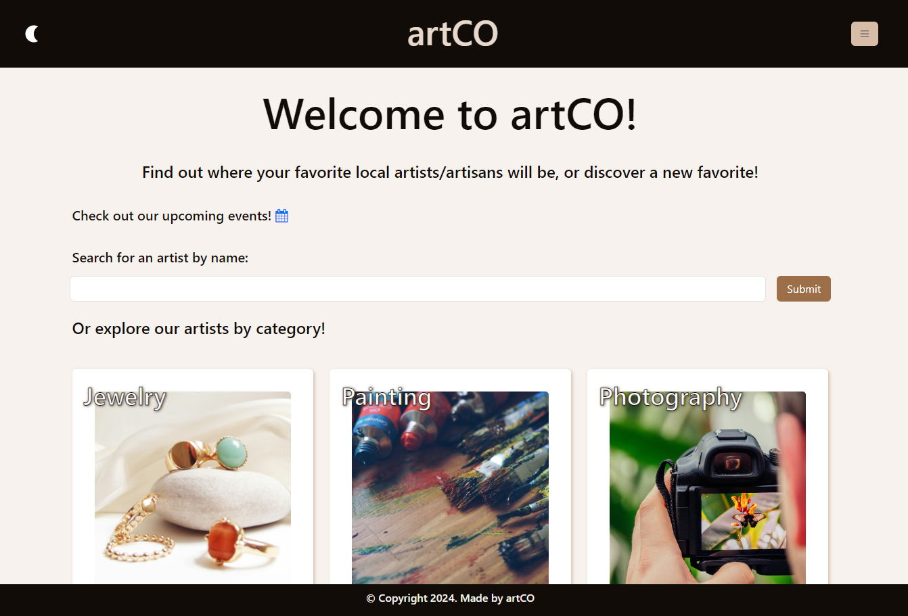

# ArtCO

See where to find your favorite Colorado artists, or find new favorites!

## [Description](#table-of-contents)

Find local Colorado artists, and see where they will be exhibiting next. Or find events, and see which artists will be there. This site allows artists to connect with their patrons, show their work, and tell potential customers where to find them. Artists can tell patrons a bit about themselves, and upload examples of their work. This site also allows patrons to search through various categories of arts and crafts to find new artists to love.

## Table-of-Contents

- [Description](#description)
- [Screenshots](#screenshots)
- [Demonstration](#demonstration)
- [Installation](#installation)
- [Usage](#usage)
- [License](#License)
- [Links](#links)
- [Credits](#credits)
- [Questions](#questions)

## [Screenshots](#table-of-contents)

## [Demonstration](#table-of-contents)

(add demonstration video here)

## [Installation](#table-of-contents)

N/A

## [Usage](#table-of-contents)

Users can sign up for an account, and either search for artists and art or, if the user is an artist themselves, create a profile and upload examples of their art for patrons to find. If the user is an artist, they can create events to attend, which will appear on the events page.

## [License](#table-of-contents)

The application is covered under the following license:

https://choosealicense.com/licenses/mit/

## [Links](#table-of-contents)

Live site: https://artco.onrender.com/
Github repo: https://github.com/ArtColorado/artco

## [Credits](#table-of-contents)

Photo Credits:

Photo by <a href="https://unsplash.com/@crystalmind_design?utm_content=creditCopyText&utm_medium=referral&utm_source=unsplash">Chloe Bolton</a> on <a href="https://unsplash.com/photos/white-and-brown-ceramic-vase-R0qthXq3jec?utm_content=creditCopyText&utm_medium=referral&utm_source=unsplash">Unsplash</a>

Photo by <a href="https://unsplash.com/@freephotocc?utm_content=creditCopyText&utm_medium=referral&utm_source=unsplash">Andrian Valeanu</a> on <a href="https://unsplash.com/photos/three-paint-tubes-near-paint-brushes-yjXlyrKIz2A?utm_content=creditCopyText&utm_medium=referral&utm_source=unsplash">Unsplash</a>

Photo by <a href="https://unsplash.com/@luisanagalicia?utm_content=creditCopyText&utm_medium=referral&utm_source=unsplash">Luisana Galicia</a> on <a href="https://unsplash.com/photos/gold-and-red-beaded-bracelet-rGz2Z6tVaeg?utm_content=creditCopyText&utm_medium=referral&utm_source=unsplash">Unsplash</a>

Photo by <a href="https://unsplash.com/@jazzrose?utm_content=creditCopyText&utm_medium=referral&utm_source=unsplash">Jazz Bainbridge</a> on <a href="https://unsplash.com/photos/blue-orange-and-green-yarn-u3ClBGVz0NA?utm_content=creditCopyText&utm_medium=referral&utm_source=unsplash">Unsplash</a>

Photo by <a href="https://unsplash.com/@itsmiki5?utm_content=creditCopyText&utm_medium=referral&utm_source=unsplash">Milan Popovic</a> on <a href="https://unsplash.com/photos/two-hammers-beside-screwdriver-BmyXTxyDL-I?utm_content=creditCopyText&utm_medium=referral&utm_source=unsplash">Unsplash</a>

photography2
Photo by <a href="https://unsplash.com/@jamie452?utm_content=creditCopyText&utm_medium=referral&utm_source=unsplash">Jamie Street</a> on <a href="https://unsplash.com/photos/black-digital-camera-capturing-yellow-flower-qWYvQMIJyfE?utm_content=creditCopyText&utm_medium=referral&utm_source=unsplash">Unsplash</a>

Other Credits:

The date-range-picker on our "add-event" page came from https://github.com/wojtekmaj/react-daterange-picker.

## [Questions](#table-of-contents)

Please contact us with any questions using the following links:

https://github.com/Meyerst19
https://github.com/MelissaCade
https://github.com/PeteOottamakorn
https://github.com/mikededo58
